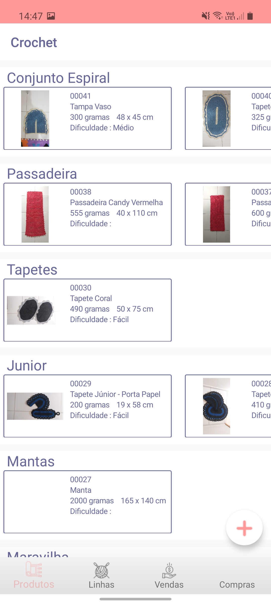
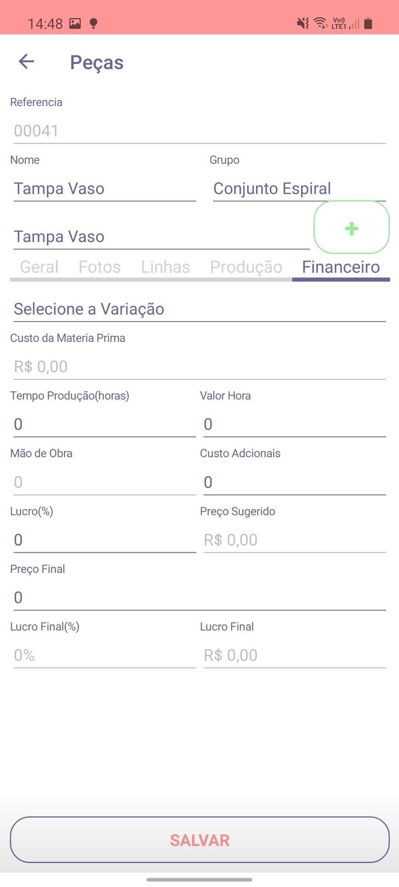
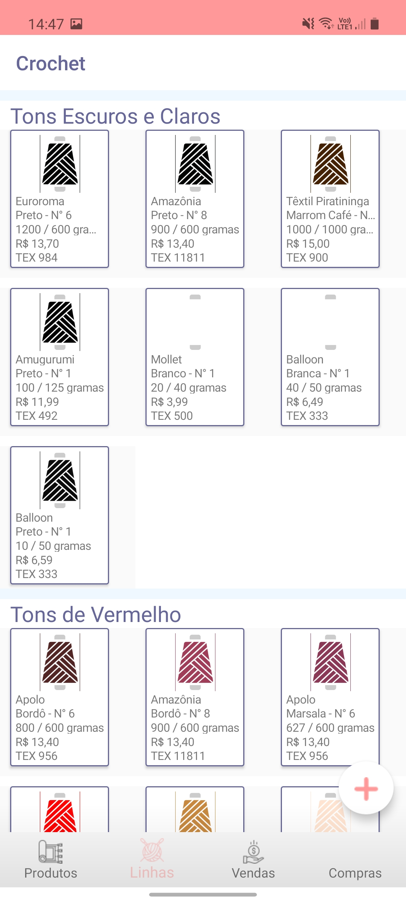
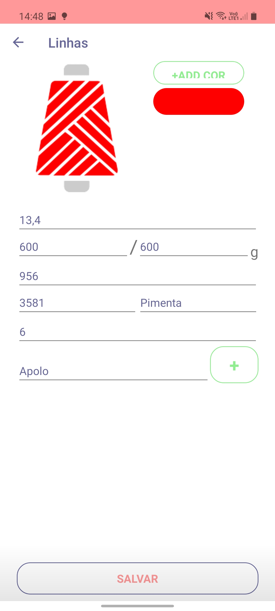
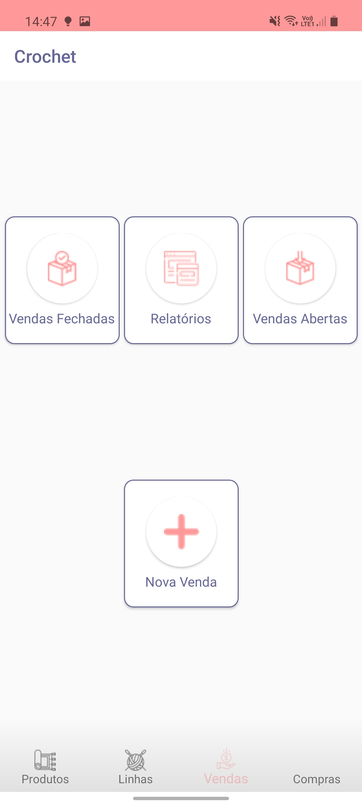
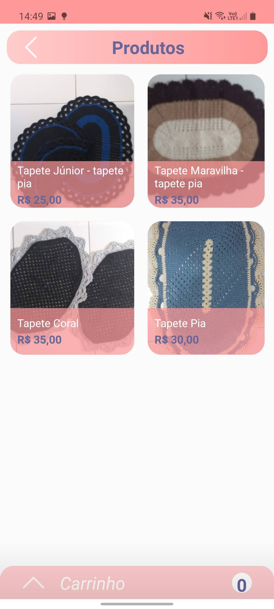
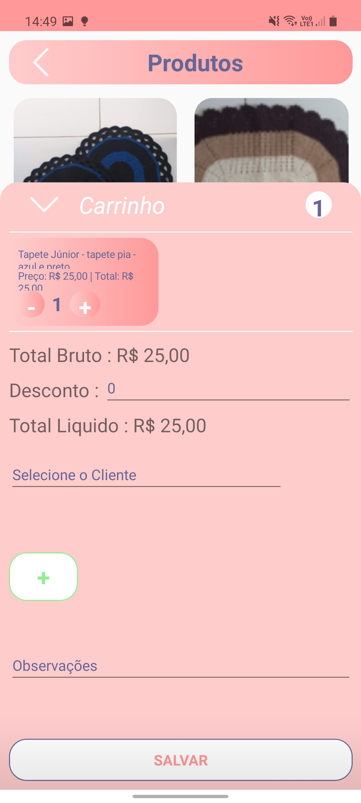

# Xamarin.Forms - Crochet

App Android e IOS para auxiliar na produção e controle de vendas de artesanato com foco em Crochê.

## Ferramentas
1. Xamarin.Forms
2. ASP.NET Core
3. Azure App Service
4. Azure SQL Server
5. Azure Blob Storage
6. Azure Functions

## Screenshots

### Splash Screen
<kbd></kbd>

### Produtos
<kbd></kbd><kbd></kbd>

### Materia Prima
<kbd></kbd><kbd></kbd>

### Vendas
<kbd></kbd><kbd></kbd>

<kbd></kbd><kbd></kbd>